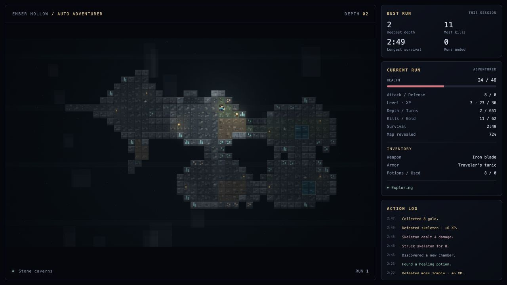
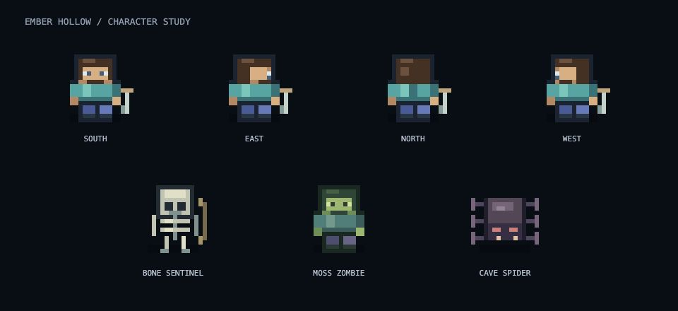

# Ember Hollow · Autonomous Dungeon

A small, original, top-down dungeon crawler that plays itself forever. Inspired by the autonomous exploration loop in [Auto Adventurer](https://kody-w.github.io/learnwithkody/demos/77-auto-adventurer.html), independently implemented with Canvas 2D. No external assets, packages, network requests, controls, menus or audio. A live status report sits beside the dungeon.

## The scene

A blocky pixel adventurer in a teal shirt and blue trousers explores a procedurally connected dungeon. Line-of-sight fog reveals walls and floors as it travels; explored areas remain dimly visible. The adventurer automatically finds paths, fights pixel skeletons, moss zombies and cave spiders, collects gold, relics and potions, heals when hurt, gains experience and levels, finds the stairs and descends. Enemies become stronger at deeper levels. Death fades into a new run with a fresh dungeon and reset equipment. Biome-colored torchlight, fog, dust, attack arcs and pickup rings animate the map.

This replaces the first side-view prototype. All rendering and simulation are original; no code or assets were copied from the reference. The status sidebar shows health, attack/defense, level and XP, depth and turns, kills and gold, survival, map exploration, inventory and the current goal. Session records track deepest depth, most kills and longest survival across automatic restarts. A bounded action log reports real discoveries, fights, loot, healing, leveling and descents. Records reset when the page is reloaded; they are not saved to disk. The report is informational and requires no input. Add `?hud=0` for the scene-only screensaver view.

## Block cave biomes

Caves cycle automatically with each descent: **Stone caverns → Ember depths → Void reach**. Jagged chamber edges, beveled block faces, clustered ore veins and glowing portals replace the old glyph walls. All textures are original Canvas pixel art, cached once per cave; there are no external assets or dependencies.

- **Stone caverns:** stone, moss, earth, copper and dark ore, teal crystals, and rippling water.
- **Ember depths:** red rock, basalt, dark volcanic blocks, glowing mineral veins, magma tiles, bubbling lava, and rising embers.
- **Void reach:** pale stone, obsidian, violet crystals, dark chasms, purple torchlight, and drifting motes.

Water, lava and chasms are impassable. Generation checks connectivity before adding them, so every floor, item and portal remains reachable. The status report names the current biome and logs each arrival.

Use [the live screensaver](https://brkcnr.github.io/ember-hollow/) for automatic cycling. Optional links keep a single biome throughout the run: [Stone](https://brkcnr.github.io/ember-hollow/?biome=stone), [Ember](https://brkcnr.github.io/ember-hollow/?biome=ember), [Void](https://brkcnr.github.io/ember-hollow/?biome=void). These combine with `&hud=0`, `&fps=60` or `&seed=caves`.

Open `standalone.html` for the complete offline version. After source edits, run `python3 tools/export.py` to rebuild it. Run `node tests/soak.cjs` to check 500 generated caves across all biomes and 72 simulated hours of exploration, combat and automatic restarts.

## Character sprites

Original blocky pixel characters with directional walk animations.

